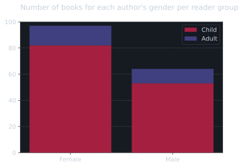
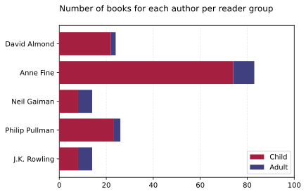
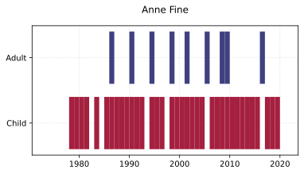
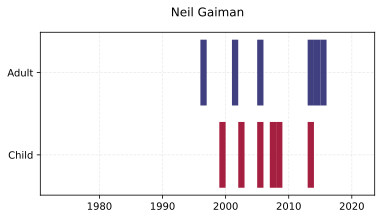
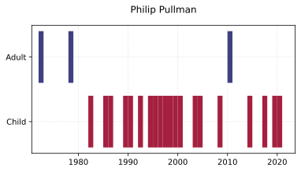
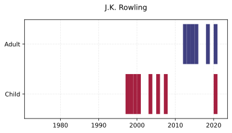

# Identifying Crosswriters’ Altering Style in Books for Children and Adults Using Supervised Machine Learning

This repo contains the code (not the data!) written as part of the Computational Literary Studies (CLS) final project at the University of Antwerp.

The objective was to identify the differences (if any) in the writing style of authors who write books for children and adults ("crosswriters").

## General

<!-- markdownlint-disable MD033 -->

    
Dependencies

    <ul>
        <li>Standard:</li>
        <ul>
            <li><code>__future__</code></li>
            <li><code>os</code></li>
            <li><code>re</code></li>
            <li><code>glob</code></li>
            <li><code>typing</code></li>
        </ul>
        <li>Third-party:</li>
        <ul>
            <li>Numpy</li>
            <li>Pandas</li>
            <li>Matplotlib</li>
            <li>Seaborn</li>
            <li>Scikit-Learn</li>
            <li>Transformers</li>
            <li>pprint</li>
        </ul>
    </ul>

Environment

<ul>
    <li>Windows 11 + WSL</li>
    <li>Python 3.9.12 (virtualenv)</li>
</ul>

<!--  -->

## EDA

The authors whose texts were examined are:

- David Almond
- Anna Fine
- Neil Gaiman
- Philip Pullman
- J.K. Rowling

> The images are light- and dark-mode aware! Check it out through your [appearance settings](https://github.com/settings/appearance).

### General plots

<picture>
    <source media="(prefers-color-scheme: light)" srcset="img/EDA/gender_per_reader_group.svg">
    <source media="(prefers-color-scheme: dark)" srcset="img/EDA/gender_per_reader_group_dark.svg">
    
</picture>

<picture>
    <source media="(prefers-color-scheme: light)" srcset="img/EDA/books_per_reader_group.svg">
    <source media="(prefers-color-scheme: dark)" srcset="img/EDA/books_per_reader_group_dark.svg">
    
</picture>

### Publications per author over time

<picture>
    <source media="(prefers-color-scheme: light)" srcset="img/EDA/publications_per_reader_group_Almond.svg">
    <source media="(prefers-color-scheme: dark)" srcset="img/EDA/publications_per_reader_group_Almond_dark.svg">
    
</picture>
<picture>
    <source media="(prefers-color-scheme: light)" srcset="img/EDA/publications_per_reader_group_Fine.svg">
    <source media="(prefers-color-scheme: dark)" srcset="img/EDA/publications_per_reader_group_Fine_dark.svg">
    
</picture>
<picture>
    <source media="(prefers-color-scheme: light)" srcset="img/EDA/publications_per_reader_group_Gaiman.svg">
    <source media="(prefers-color-scheme: dark)" srcset="img/EDA/publications_per_reader_group_Gaiman_dark.svg">
    
</picture>
<picture>
    <source media="(prefers-color-scheme: light)" srcset="img/EDA/publications_per_reader_group_Pullman.svg">
    <source media="(prefers-color-scheme: dark)" srcset="img/EDA/publications_per_reader_group_Pullman_dark.svg">
    
</picture>
<picture>
    <source media="(prefers-color-scheme: light)" srcset="img/EDA/publications_per_reader_group_Rowling.svg">
    <source media="(prefers-color-scheme: dark)" srcset="img/EDA/publications_per_reader_group_Rowling_dark.svg">
    
</picture>
