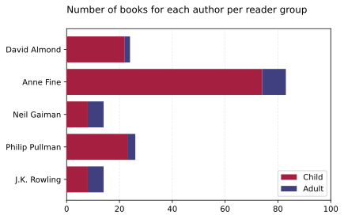
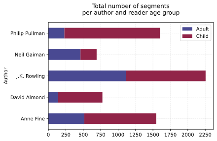
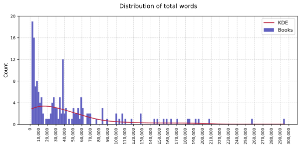
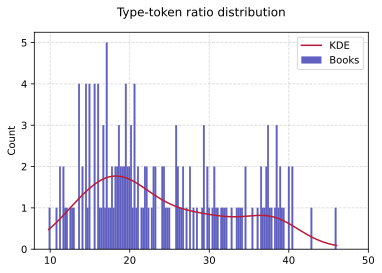
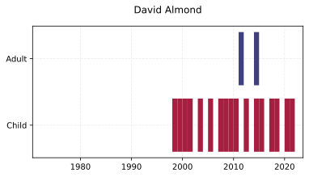
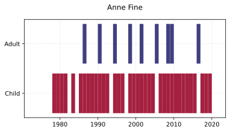
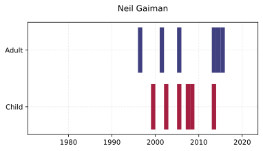
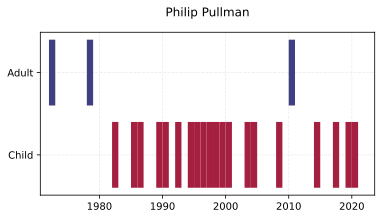

# Identifying Crosswriters’ Altering Style in Books for Children and Adults Using Supervised Machine Learning

This repo contains the code (not the data!) written as part of the Computational Literary Studies (CLS) final project at the University of Antwerp.

The objective was to identify the differences (if any) in the writing style of authors who write books for children and adults ("crosswriters") by only focusing on content words.

The paper is [available in PDF format](Identifying_Crosswriters_Altering_Style_in_Books_for_Children_and_Adults_Using_Supervised_Machine_Learning.pdf).

## Development

<!-- markdownlint-disable MD033 -->
<details>
    <summary>Dependencies</summary>
    <ul>
        <li>Standard:</li>
        <ul>
            <li><code>__future__</code></li>
            <li><code>os</code></li>
            <li><code>re</code></li>
            <li><code>glob</code></li>
            <li><code>typing</code></li>
        </ul>
        <li>Third-party:</li>
        <ul>
            <li>Numpy</li>
            <li>Pandas</li>
            <li>Matplotlib</li>
            <li>Seaborn</li>
            <li>Scikit-Learn</li>
            <li>Transformers</li>
            <li>pprint</li>
        </ul>
    </ul>
</details>

<details>
<summary>Environment</summary>
<ul>
    <li>Windows 11 + WSL</li>
    <li>Python 3.9.12 (virtualenv)</li>
</ul>
</details>
<!--  -->

## Abstract

Stylometry is the quantitative study of literary style through computational distant reading methods. It is based on the observation that authors tend to write in relatively consistent, recognisable, and unique ways (Laramée, 2018). Identifying the similarities and differences in style, content, and genre between literature intended for children and adults has always been under the radar of researchers in the field of Computational Literary Studies. However, only recently has examining the implications of cross-writing (i.e., writing works for various readership age groups) gotten attention. In this study, supervised machine learning methods were applied to get a better understanding on whether and how such authors (“crosswriters”) alter their style when targeting a different age group, based entirely on content words. The study was conducted on 5 English authors, and the SVM models reach an F1 macro score of .74 when predicting the age group using all texts and .93 on average for each of the authors individually. To achieve these results, it was essential to overcome the issue of overfitting on the characters of the stories, which was made possible by implementing a Named Entity Recognition (NER) step in the preprocessing pipeline and leaving at least one book by each author out of the train set entirely in each of the 10 folds during Cross-Validation.

## Exploratory Data Analysis

The authors whose texts were examined are:

- David Almond
- Anna Fine
- Neil Gaiman
- Philip Pullman
- J.K. Rowling

> The images are light and dark-mode aware! Check it out through your [appearance settings](https://github.com/settings/appearance).

### Corpus

Number of books per gender of authors:

<picture>
    <source media="(prefers-color-scheme: light)" srcset="img/EDA/light/gender_per_reader_group.svg">
    <source media="(prefers-color-scheme: dark)" srcset="img/EDA/dark/gender_per_reader_group_dark.svg">
    
</picture>

Number of books per reader age group:

<picture>
    <source media="(prefers-color-scheme: light)" srcset="img/EDA/light/books_per_reader_group.svg">
    <source media="(prefers-color-scheme: dark)" srcset="img/EDA/dark/books_per_reader_group_dark.svg">
    
</picture>

Number of segments per author and reader age group:

<picture>
    <source media="(prefers-color-scheme: light)" srcset="img/EDA/light/total_segments_per_author_age_group.svg">
    <source media="(prefers-color-scheme: dark)" srcset="img/EDA/dark/total_segments_per_author_age_group_dark.svg">
    
</picture>

Distribution of total words:

<picture>
    <source media="(prefers-color-scheme: light)" srcset="img/EDA/light/total_words_dist.svg">
    <source media="(prefers-color-scheme: dark)" srcset="img/EDA/dark/total_words_dist_dark.svg">
    
</picture>

Type-token ratio:

<picture>
    <source media="(prefers-color-scheme: light)" srcset="img/EDA/light/type_token_ratio_dist_all.svg">
    <source media="(prefers-color-scheme: dark)" srcset="img/EDA/dark/type_token_ratio_dist_all_dark.svg">
    
</picture>

### Authors

#### Publications per author over time

<picture>
    <source media="(prefers-color-scheme: light)" srcset="img/EDA/light/publications_per_reader_group_Almond.svg">
    <source media="(prefers-color-scheme: dark)" srcset="img/EDA/dark/publications_per_reader_group_Almond_dark.svg">
    
</picture>

<picture>
    <source media="(prefers-color-scheme: light)" srcset="img/EDA/light/publications_per_reader_group_Fine.svg">
    <source media="(prefers-color-scheme: dark)" srcset="img/EDA/dark/publications_per_reader_group_Fine_dark.svg">
    
</picture>

<picture>
    <source media="(prefers-color-scheme: light)" srcset="img/EDA/light/publications_per_reader_group_Gaiman.svg">
    <source media="(prefers-color-scheme: dark)" srcset="img/EDA/dark/publications_per_reader_group_Gaiman_dark.svg">
    
</picture>

<picture>
    <source media="(prefers-color-scheme: light)" srcset="img/EDA/light/publications_per_reader_group_Pullman.svg">
    <source media="(prefers-color-scheme: dark)" srcset="img/EDA/dark/publications_per_reader_group_Pullman_dark.svg">
    
</picture>

<picture>
    <source media="(prefers-color-scheme: light)" srcset="img/EDA/light/publications_per_reader_group_Rowling.svg">
    <source media="(prefers-color-scheme: dark)" srcset="img/EDA/dark/publications_per_reader_group_Rowling_dark.svg">
    
</picture>

## Results

<!-- markdownlint-disable MD010 -->
|                     | **Pre-NER** | **~** | **Post-NER** | **~**
| :-------------------|:-----------:|:-----:|:------------:|:-----:
|                     | **Acc.**    | **F1**| **Acc.**     | **F1**
| **David Almond**    | .914        | .795  | .933         | .857  
| **Anne Fine**       | .843        | .800  | .979         | .976  
| **Neil Gaiman**     | .939        | .928  | .931         | .916  
| **Phillip Pullman** | .918        | .771  | .962         | .906  
| **J.K. Rowling**    | .991        | .991  | .999         | .999  
| **All authors**     | .994        | .851  | .795         | .743

## Citation

```bibtex
@article{
    title = {Identifying Crosswriters' Altering Style in Books for Children and Adults Using Supervised Machine Learning},
    author = {{Dimitris Boumparis}},
    organization = {{University of Antwerp}},
    year = {2022},
    url = {https://github.com/dimboump/crosswriters}
}
```
